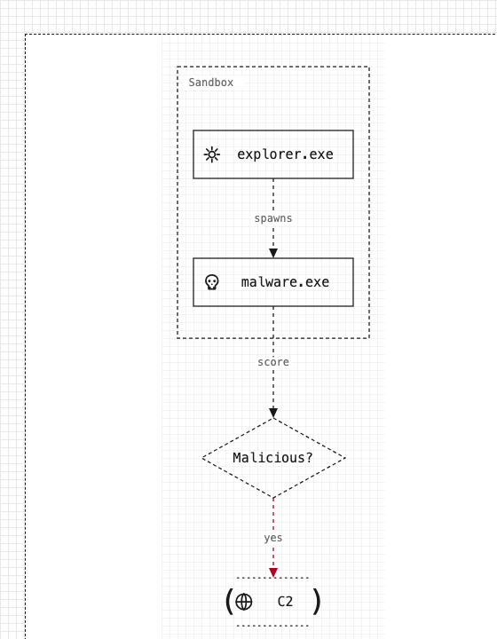
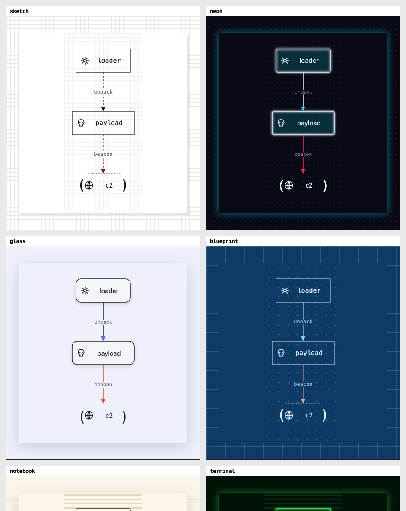
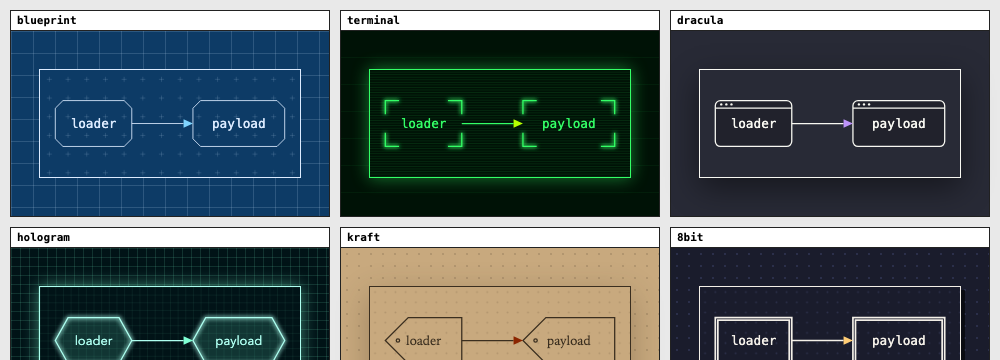
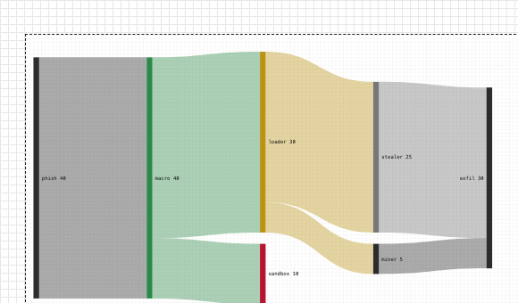
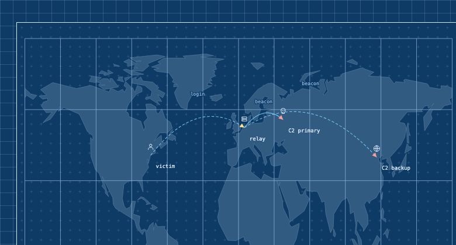
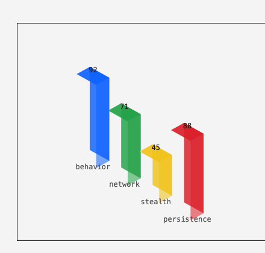
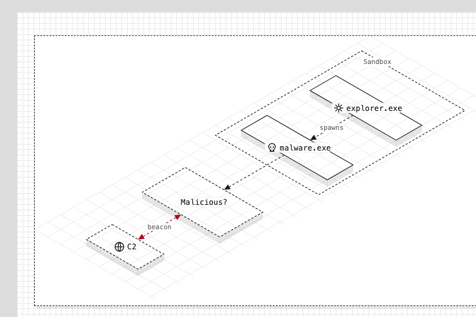
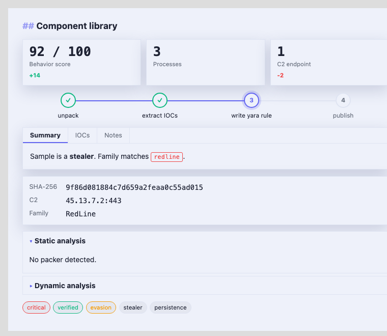

# VizEngine

A zero-dependency, browser-first JavaScript visualize engine. Load it with a
single `<script>` tag, feed it a **markdown-superset** document, and it renders
a fully themed panel: prose, tables, images/GIFs, code, an interactive diagram
DSL (flowcharts, trees, sequence, timeline, bar/pie/gantt), and a library of
report components — all in one of **20 distinct visual design languages**.

Built for security-analysis panels (process trees, execution flows, network
maps, IOC reports) and for streamed AI output. **20 themes**, **60+
components**, animations, and a **real 3D** graph — all zero-dependency.

<p align="center">
  
</p>

## 20 design languages, not 20 palettes

Each theme is a complete visual language — its own font, canvas texture, **node
shape**, strokes, shadows and glow — not a recolor of the same look.

<p align="center">
  
</p>

The node *geometry itself* changes per theme — cut-corners, terminal brackets,
window-chrome, hexagons, tag shapes, double borders:

<p align="center">
  
</p>

`sketch` · `sketch-dark` · `blueprint` · `neon` · `notebook` · `glass` ·
`terminal` · `carbon` · `8bit` · `ink` · `crt-amber` · `synthwave` ·
`midnight` · `solarized` · `dracula` · `nord` · `mono-print` · `hologram` ·
`kraft` · `wireframe`

Switch live with `panel.setTheme(name)`; enumerate with `VizEngine.themes`.

## Quick start

```html
<script src="dist/vizengine.js"></script>
<div id="report"></div>
<script>
  const panel = new VizEngine.Panel(document.getElementById('report'), {
    theme: 'sketch',                 // any of VizEngine.themes
    interactive: true,               // draggable graphs (optional)
    onNodeClick: (node) => console.log(node),   // {id, label, shape, title}
    onNodeHover: (nodeOrNull) => {},
  });

  panel.render(sourceText);   // full render
  panel.stream(chunk);        // append + tolerant re-render (AI streaming)
  panel.setTheme('neon');     // live theme switch
  panel.exportSVG(0);         // nth diagram → self-contained SVG string
  panel.exportPNG(0);         // nth diagram → Promise<Blob>
</script>
```

**Authoring with an LLM?** See [`llms.txt`](llms.txt) — a complete reference of
every fence kind, component, inline widget, flag and API, written for LLMs to
generate VizEngine source.

**Visual editors** — `demo/composer.html` is a drag-drop document builder: drag
any of the 66 components from the palette, edit their properties, and copy the
generated source (`VizEngine.catalog`). `demo/editor.html` is a focused graph
node editor (`VizEngine.Editor`).

**Prebuilt bundles** — grab `vizengine.js` / `vizengine.min.js` from the
[Releases](https://github.com/Malwation/visualize_engine/releases) page.

Build the bundle: `npm install && npm run build` → `dist/vizengine.js`
(+ `.min.js`). Run tests: `npm test` (139 unit tests). Explore locally: serve
the repo and open `demo/examples.html` (gallery of 83 cards with 230+ detailed
variants), `demo/composer.html` (drag-drop builder for all 66 components), or
`demo/` (live playground).

## The format

A GFM-style markdown subset — headings, `**bold**` / `*em*` / `` `code` `` /
`[links](url)`, lists, task lists (`- [x]`), blockquotes, pipe tables, fenced
code, ``, `---` — plus everything below.

### Diagram fences

````markdown
```graph TD            direction: TD | LR | BT | RL, plus flags: iso, interactive
sandbox: [[ Sandbox ]]                  container (dashed frame)
sandbox.mal: [ @skull malware.exe ] "tooltip"   box · @icon · hover title
check: { Malicious? }                   diamond
done: ( @globe C2 )                     stadium

sandbox.mal -> check : "score"          arrow
check -> done : "yes" [err]             colored edge (ok|warn|err|accent)
check <-> done                          bidirectional
sandbox.mal -- check                    plain line
```
````

Other diagram kinds share the family: `tree` (process trees), `sequence`
(actors + lifelines + messages), `timeline` (stamped events), `bars`, `pie`
(donut), `gantt`, `sankey` (weighted flow ribbons), `treemap` (squarified),
`flame` (call stacks), `geomap` (world threat map by city / lat,lon), and
`network` (force-directed topology). All tolerant — invalid lines are skipped
and partial mid-stream input renders whatever is valid so far.

<p align="center">
  
  
</p>

### Interop & export

Bring existing diagrams in, and take renderings out:

- **Mermaid import** — `` ```mermaid `` fences (or `VizEngine.fromMermaid()`)
  render Mermaid flowcharts in any theme.
- **Graphviz DOT import** — `` ```dot `` fences (or `VizEngine.fromDot()`).
- **ASCII export** — `panel.toAscii(0)` (or `VizEngine.renderAscii(layout)`)
  turns a graph/tree into copy-pasteable monospace box-art.
- **Web component** — `<viz-engine theme="neon">…source…</viz-engine>` drops the
  engine into any page with zero JS (auto-registers on load).

- **Icons** — `@name` prefix on any label: `server database file gear globe
  user shield bug folder lock alert terminal chip cloud mail skull`.
- **Isometric / 3D** — `iso`, `graph3d`, `bars3d` (see the 3D section below).

### Interactive graphs

Add `interactive` (`graph TD interactive`) or pass `interactive: true` to the
Panel:

- **drag** nodes — incident edges re-route live
- **hover-focus** — dims everything except the hovered node and its neighbors
- **collapsible containers** — click a container's `▾` toggle to fold children

### Animations

Add an `anim` flag to any graph — `flow` (marching edges), `draw` (staggered
reveal), `pulse`, `beacon` (ping rings), `trace` (attack-path). Components
auto-animate: stat/score count up, progress bars & gauges fill, pie slices
sweep. Standalone animated widgets: `:::spinner`, `:::loader`, `:::pulsedot`,
`:::typewriter`, `:::radar`, `:::countdown`, `:::beacon`, `:::matrix`. All
respect `prefers-reduced-motion`. See **`demo/animations.html`** for 21 live
examples.

### Real 3D

- **`graph3d`** — nodes get true 3D coordinates, ranked onto stacked layers and
  perspective-projected while rotating (~7s/revolution, hover to pause).
- **`bars3d`** — extruded isometric bar columns.
- **`graph TD iso`** — 2.5D isometric projection of any graph (composes with
  `anim`).

<p align="center">
  
  
</p>

### Component library

<p align="center">
  
</p>

Directive blocks `:::name … :::`:

```markdown
:::tabs
== Summary
first panel …
== IOCs
second panel …
:::

:::accordion       collapsible items
:::steps           horizontal stepper — lines prefixed `x ` (done) / `> ` (current)
:::meta            term :: value  card grid
:::stat            value | label | delta   KPI tiles (delta +/- colors)
:::chips           a, b, !crit, +ok, ~warn   rounded tag row
:::
```

Fences and inline:

```markdown
```filetree        collapsible 2-space-indented file/registry tree
```diff            +added / -removed / context coloring

progress [[progress 72]]  ·  [[progress 3/5]]      inline bar
severity [[sev 4/5]]                               inline dots
badges   [[high]] [[!danger]] [[+ok]] [[~warn]]
```

More directive components: `grid`, `card`, `alert`, `kbd`, `terminal`,
`columns`, `divider`, `status`, `gauge`, `rating`, and malware-analysis
widgets — `ioc` (typed indicator rows + copy), `verdict` (malicious/suspicious/
clean banner), `mitre` (ATT&CK technique chips), `hexdump`, `yara` (rule
highlight), `score`, `heatmap`, `dtimeline`, `compare`, `legend`.

Plus rich blocks: callouts (`> [!note|tip|warn|danger|success]`), definition
lists (`term :: value`), collapsible sections (`+++ … +++`), and a
Claude-web-style **HTML previewer** for closed ` ```html ` fences (sandboxed
iframe, scripts isolated). 60+ components in all — browse them (with 230+
detailed variants) in **`demo/examples.html`**.

## API

| Member | Description |
|---|---|
| `new VizEngine.Panel(el, opts)` | `opts: {theme, interactive, onNodeClick, onNodeHover}` |
| `panel.render(source)` | idempotent full render |
| `panel.stream(chunk)` | append chunk, coalesced tolerant re-render |
| `panel.setTheme(name)` | live theme switch |
| `panel.exportSVG(i=0)` / `exportPNG(i=0)` | nth diagram as SVG string / PNG Blob |
| `panel.clear()` / `panel.destroy()` | reset / teardown |
| `panel.toAscii(i=0)` | nth graph/tree as copy-pasteable ASCII box-art |
| `VizEngine.render(el, src, opts)` | one-shot convenience → Panel |
| `VizEngine.fromMermaid(text)` / `fromDot(text)` | import → graph model |
| `VizEngine.themes` / `VizEngine.version` | metadata |

All document text enters the DOM via `textContent`; URLs are allow-listed
(`http(s)`, relative, `data:image/*`), links get `rel="noopener noreferrer"`,
and the HTML previewer runs in a `sandbox="allow-scripts"` iframe.

## Architecture

```
src/parse/     markdown, graph, tree, sequence, timeline, bars, gantt  — text → models (pure, tested)
src/layout/    layered, tree, sequence, timeline, bars, pie, gantt      — models → cell-grid coords (pure, tested)
src/render/    blocks, diagram, components, icons                       — models → DOM / SVG
src/interact/  viewport, tooltip, graphtools                            — pan/zoom, tooltips, drag/focus/collapse
src/core/      panel, theme                                             — orchestration, 20 themes
src/kinds.js · src/units.js · src/export.js · src/util/
```

Diagram layout is computed in monospace character cells and snapped to a grid,
so output always looks hand-set. Parsers never throw. Zero runtime
dependencies; esbuild is the only devDependency.

## License

UNLICENSED — internal Malwation project.
